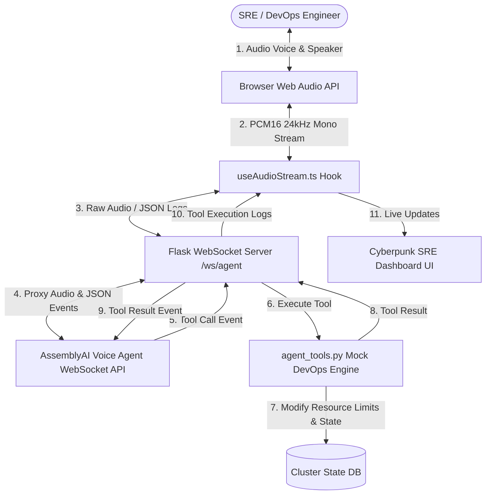

# OpsVoice AI — Autonomous Voice Incident Commander for SRE & DevOps

OpsVoice AI is a real-time, low-latency, voice-activated incident response commander for DevOps and SRE teams. It connects directly to your cluster resources to diagnose issues, view log outputs, execute self-healing container restarts with resource bumps, and compile post-mortem documentation—all powered entirely by voice commands.

This project was built for the **AssemblyAI Voice Agent Hackathon**.

---

## 🛠️ System Architecture

The following diagram illustrates how SRE voice inputs are streamed to AssemblyAI, processed with custom JSON-schema DevOps tool routing, and returned as streaming audio/dashboard updates in real-time.



---

## 🚀 Key Features

*   **Real-time Low-Latency Voice Control**: Stream audio chunks bidirectional (24kHz PCM16) to provide hands-free commands.
*   **DevOps Tool Integration (JSON Schema)**: Auto-routes LLM intentions into structured function execution for:
    *   `check_cluster_health`: Returns aggregate cluster metrics and status.
    *   `get_logs`: Retrieves recent stdout/stderr diagnostic files for containers.
    *   `restart_pod`: Restarts crashed instances, optionally bumping memory ceilings.
    *   `generate_post_mortem`: Compiles Markdown incident post-mortems.
*   **Futuristic Cyberpunk UI**: Sleek SRE command-center layout featuring glassmorphism, responsive status indicators, and live pod grids.
*   **Reactive Soundwave Visualizer**: Custom volume visualizer that pulses and changes heights dynamically based on the microphone input.
*   **Interactive Scrolling SRE Terminal**: Live console log printout that streams user speech, agent thoughts, system status, and tool inputs in real-time.
*   **Smart Barge-In Support**: Agent immediately silences its current audio output stream the moment the user starts speaking.

---

## ⚡ Tech Stack & Architecture

### Backend
*   **Framework**: Python Flask
*   **WebSockets**: Flask-Sock
*   **Websocket client**: `websocket-client` for server-to-server proxy connections
*   **Config**: `python-dotenv` for key configuration

### Frontend
*   **Core**: Next.js 15 (App Router) & React
*   **Styling**: Tailwind CSS & Lucide Icons
*   **Streaming Hook**: HTML5 Web Audio API using dynamic inline `AudioWorklet` processor for non-blocking Float32 to Int16 conversions.

---

## ⚙️ Quickstart Setup

### Prerequisites
*   Python 3.10+
*   Node.js 18+
*   AssemblyAI API Key (get it from the [AssemblyAI Dashboard](https://www.assemblyai.com/dashboard))

### 1. Setup the Python Backend
1.  Navigate to the backend directory:
    ```bash
    cd backend
    ```
2.  Create a `.env` file from the template:
    ```bash
    copy .env.example .env
    ```
3.  Open `.env` and fill in your AssemblyAI API Key:
    ```env
    ASSEMBLYAI_API_KEY=your_actual_assemblyai_api_key
    ```
4.  Install dependencies:
    ```bash
    pip install -r requirements.txt
    ```
5.  Start the Flask server:
    ```bash
    python app.py
    ```
    The server will run on `http://localhost:5000` with WebSocket route `/ws/agent`.

### 2. Setup the Next.js Frontend
1.  Navigate to the frontend directory:
    ```bash
    cd frontend
    ```
2.  Install dependencies:
    ```bash
    npm install
    ```
3.  Start the Next.js development server:
    ```bash
    npm run dev
    ```
    Open `http://localhost:3000` in your web browser.

---

## 🎙️ AssemblyAI Voice Agent Integration

OpsVoice AI integrates with the **AssemblyAI Voice Agent API** by setting up a persistent, low-latency WebSocket connection.

### WebSocket Connection
The backend establishes a WebSocket handshake with AssemblyAI's voice client endpoint:
`wss://agents.assemblyai.com/v1/ws`
It includes the API Key in the headers for secure authentication:
`Authorization: Bearer <ASSEMBLYAI_API_KEY>`

### Session Configuration (`session.update`)
Once connected, the server sends a `session.update` command containing the agent's **system prompt**, registered **tools**, and a **welcome greeting**:
```json
{
  "type": "session.update",
  "session": {
    "system_prompt": "You are OpsVoice AI, an autonomous SRE voice commander...",
    "tools": [ ...JSON_SCHEMA_TOOL_DEFINITIONS... ],
    "greeting": "OpsVoice AI Incident Commander online. Ready to inspect cluster health..."
  }
}
```

### Tool Execution Flow
1.  The AssemblyAI LLM detects the SRE request and sends a `tool.call` event containing a `call_id` and arguments.
2.  The Flask proxy intercepts the message, routes the execution to `agent_tools.py`, and gets a string result.
3.  The backend sends a `tool.result` event back to AssemblyAI:
    ```json
    {
      "type": "tool.result",
      "tool_result": {
        "call_id": "call_abc123",
        "output": "SUCCESS: Container auth-service restarted with memory bump..."
      }
    }
    ```
4.  AssemblyAI processes the tool output and speaks the response back to the user via the `reply.audio` stream.

---

## 🛠️ Scenario Demo Walkthrough

### Incident: The `auth-service` SEV-1 Outage
1.  **Open Dashboard**: You load the SRE page. The metric cards show **1 Failed Pod** and **1 Active Alarm** (`auth-service` is in `CrashLoopBackOff` state).
2.  **Activate Voice Commander**: Click **CONNECT COMMANDER** or select a Suggest Prompt Helper. The status turns to **Linked**.
3.  **Run Health Diagnostics**: Say *"OpsVoice, check cluster health"* or click Prompt Helper 1.
    *   *Terminal Output*: Shows the tool execution and result.
    *   *Agent Voice Response*: *"The cluster has 1 active alert. Service auth-service is in CrashLoopBackOff with 0 replicas due to an OOMKilled exit."*
4.  **Inspect Crash Logs**: Say *"OpsVoice, retrieve the logs for auth-service"* or click Prompt Helper 2.
    *   *Terminal Output*: Displays container dump ending with `FATAL Container exited with code 137 (OOMKilled)`.
5.  **Trigger Self-Healing Restart**: Say *"OpsVoice, restart auth-service and increase the memory limit"* or click Prompt Helper 3.
    *   *Terminal Output*: Confirms `restart_pod` executed with `memory_bump=True`.
    *   *Live Metrics Update*: Top cards show **0 Failed Pods**, **0 Active Alarms**, and CPU/Memory limits automatically scale. The bottom service grid updates `auth-service` status to **Running**.
6.  **Compile Documentation**: Say *"OpsVoice, write a post mortem for the auth-service outage"* or click Prompt Helper 4.
    *   *Modal Overlay*: A beautiful markdown modal slides up containing the complete incident post-mortem with RCA, severity levels, timeline, and action items. Click **Copy Markdown** to save it to your clipboard.
